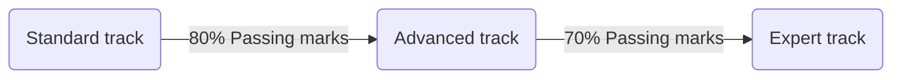

import { Card, Col, Row } from 'antd';

# Getting Started

## What is Data Engineering?

The Data Engineering Ecosystem includes several different components. It includes disparate data types, formats, and sources of data. Data Pipelines gather data from multiple sources, transform it into analytics-ready data, and make it available to data consumers for analytics and decision-making. Data repositories, such as relational and non-relational databases, data warehouses, data marts, data lakes, and big data stores process and store this data. Data Integration Platforms combine disparate data into a unified view for the data consumers. You will learn about each of these components. You will also learn about Big Data and the use of some of the Big Data processing tools. 

A typical Data Engineering lifecycle includes architecting data platforms, designing data stores, and gathering, importing, wrangling, querying, and analyzing data. It also includes performance monitoring and finetuning to ensure systems are performing at optimal levels. You will learn more about these systems with hands-on learning.

The first type of data engineering is SQL-focused. The work and primary storage of the data is in relational databases. All of the data processing is done with SQL or a SQL-based language. Sometimes, this data processing is done with an ETL tool. The second type of data engineering is Big Data–focused. The work and primary storage of the data is in Big Data technologies like Hadoop, Cassandra, and HBase. All of the data processing is done in Big Data frameworks like MapReduce, Spark, and Flink. While SQL is used, the primary processing is done with programming languages like Java, Scala, and Python.

<iframe width="100%" height="480" src="https://www.youtube.com/embed/qWru-b6m030" title="How Data Engineering Works" frameborder="0" allow="accelerometer; autoplay; clipboard-write; encrypted-media; gyroscope; picture-in-picture" allowfullscreen></iframe>

## Why we need Data Engineers?

Internet companies create a lot of data. Datasets are getting larger and messier in he internet era where there are large datasets for all the actions and interactions users make with your website all the way to product descriptions, images, time series info, comments etc.

It is said that data is the new oil. For natural oil, we also need a way to drill and mine this oil for it to be useful. In the same way, we need a way to mine and make sense of all this data to be useful.

On one had, there is a desire by executives and management to get insights from these datasets.

There is also a desire by data scientists and ML practitioners to have clean datasets to model with.

There are some really interesting trade-offs to make when you do this. And knowing about these can help you in your own journey as a data scientist or ML person working with large data. Irrespective of where you are in your data journey, I think you will find these interesting.

## Roles in Data Teams

> Data engineers are in the business of moving data—either getting it from one location to another or transforming the data in some man‐ ner. It is these hard workers who provide the digital grease that makes a data project a reality.

<iframe width="100%" height="480" src="https://www.youtube.com/embed/m5hLUknIi5c" title="Roles in Data Science Teams" frameborder="0" allow="accelerometer; autoplay; clipboard-write; encrypted-media; gyroscope; picture-in-picture" allowfullscreen></iframe>

## How a typical Data Engineering Pipeline looks

This is one example of a standard data pipeline in AWS ecosystem:

## Know more about Data Engineering Basics

1. [Data Engineering Roadmap](https://knowledgetree.notion.site/Data-Engineering-Roadmap-6e543497f9074aba89520b45b678d32f)
2. [Approaching the data pipeline architecture](https://knowledgetree.notion.site/Approaching-the-data-pipeline-architecture-214bdf596037454ca3f879894035c83f)
3. [The Data Engineering Megatrend: A Brief History](https://www.rudderstack.com/blog/the-data-engineering-megatrend-a-brief-history)
4. [How to gather requirements for your data project](https://www.startdataengineering.com/post/n-questions-data-pipeline-req/)
5.  [Five Steps to land a high paying data engineering job](https://www.startdataengineering.com/post/n-steps-high-pay-de-job/)

---

## Our Learning Framework

### Learning

Learning will happen under the guided instructor-led sessions. We will do the following activites to learn the core concepts of data engineering:

1. Theory and Case: We will find the answers to - 1) What is the particular technology/tool/concept is about, and 2) Why we are learnig about that? How things works in real-life is important and student should understand this very well. Along with the theory, we will also understand how companies/people uses the given technology/tool/concept in real-world to solve their business problems.
2. Lab and Presentation: A guided session with instructur where instructor will show the process step-by-step in real-time and students will ask questions and clarify their doubts. Each lab will be broken down into steps after each step, each student will present that step in their own system/environment with some variations (if possible).
   
### Assessment

Student assessment is the most important factor in tracking the progress of the students. We will do the assessment using the following methods and drills:

1. Mock Interview (MI): This is a 1:1 mock interview between the instructor and the student. Student will be assessed based on the quality of responses.
2. Peer Interview (PI): This is a 1:1 peer interview between a pair of students. Student will be assessed based on the quality of questions and quality of responses.
3. Lab Assignment (LA): A hypothetical data engineering business case will be provided and the student has to apply the data engineering skills to solve the business requirement. Student will be assessed based on the assignment-specific factors and timely submission.
4. Capstone Project (CP): Student will pick a brand/company persona and create a hypothetical scenario. Then the student will solve the scenario and submit the code for review. Student will be assessed based on the topic-specific factors and timely submission.

## Our Tech stack

## Features
- Industrial Project-based Labs
- Essential Skills Track
- Assignments
- Resume Buildups
- Mock Interviews
- Capstones
- Exclusive access to resources

## Every Week
- New Labs
- Full Mock Interviews
- Resume Buildups
- Essential Skill sessions
- Take-home Assignments
- Capstone Project Discussion
- Industrial Case Study Discussion
- General Discussion

## Essential Skills

<Row gutter={16}>
    <Col span={8}>
    <Card title="Python" size="small">
        Python helps data engineers to build efficient data pipelines as many data engineering tools use Python in the backend. Moreover, various tools in the market are compatible with Python and allow data engineers to integrate them into their everyday tasks by simply learning Python.
    </Card>
    </Col>
    <Col span={8}>
    <Card title="SQL" size="small">
        Listed as one of the top technologies on data engineer job listings, SQL is a standardized programming language used to manage relational databases (not exclusively) and perform various operations on the data in them. Data Engineering using Spark SQL.
    </Card>
    </Col>
    <Col span={8}>
    <Card title="AWS" size="small">
        Data engineers need to meet various requirements to build data pipelines. This is where AWS data engineering tools come into the scenario. AWS data engineering tools make it easier for data engineers to build AWS data pipelines, manage data transfer, and ensure efficient data storage.
    </Card>
    </Col>
</Row>
 
<Row gutter={16}>
    <Col span={8}>
    <Card title="Shell" size="small">
        Unix machines are used everywhere these days and as a data engineer, they are something we interact with every single day. Understanding common shell tools and how to use them to manipulate data will increase your flexibility and speed when dealing with day to day data activities.
    </Card>
    </Col>
    <Col span={8}>
    <Card title="Git" size="small">
        Git is one of the skills that every software engineer needs to manage the code base efficiently. GitHub or any version control software is important for any software development projects, including those which are data driven. GitHub allows version control of your projects through Git.
    </Card>
    </Col>
    <Col span={8}>
    <Card title="VS code" size="small">
        The VSCode provides rich functionalities, extensions (plugins), built-in Git, ability to run and debug code, and complete customization for the workspace. You can build, test, deploy, and monitor your data engineering applications and pipelines without leaving the application.
    </Card>
    </Col>
</Row>
 
<Row gutter={16}>
    <Col span={8}>
    <Card title="Colab" size="small">
        Jupyter Notebook is one of the most widely used tool in data engineering that use Python. This is due to the fact, that it is an ideal environment for developing reproducible data pipelines with Python. Colaboratory, or “Colab” for short, is a provide Jupyter-like environment on the cloud.
    </Card>
    </Col>
</Row>

## Curriculum

Standard track

_Standard Track Curriculum Starts_

* Week 1
    * Candidate Onboarding
    * Getting Started with Data Engineering
    * Workspace Setup
* Week 2
    * SQL Data Modeling with Postgres
    * Data Warehousing with Snowflake
* Week 3
    * Data Lakes with S3
* Week 4
    * Data Transformation with Python
    * Data Transformation with SQL
    * Data Transformation with AWS Lambda
* Week 5
    * Data Pipeline and Orchestration with Apache Airflow
    * IaC with AWS CloudFormation

_Standard Track Curriculum Ends_

_Standard Track Marketing Starts_

Advanced track

_Advanced Track Curriculum Starts_

* Week 6
    * NoSQL Data Modeling with Cassandra
    * Data Warehousing with Amazon Redshift
* Week 7
    * Data Lakehouses with Delta Lake
    * Data Transformation with Databricks PySpark
* Week 8
    * Data Transformation with AWS Glue Studio
    * Data Transformation with dbt
    * Data Quality and Validation with Great Expectations
* Week 9
    * Real-time Event Streaming with Apache Kafka
    * Real-time Event Streaming with Amazon Kinesis
* Week 10
    * Container Orchestration with Amazon ECS
    * REST API with FastAPI
* Week 11
    * CICD Pipeline with GitHub Actions
    * IaC with AWS CloudFormation

_Advanced Track Curriculum Ends_

_Advanced Track Marketing Starts_

Expert track

_Expert Track Curriculum Starts_

* Week 12
    * NoSQL Data Modeling with DynamoDB
    * Advanced Data Engineering with Databricks
* Week 13
    * Data Pipeline and Orchestration with AWS Step Functions
    * Data Pipeline and Orchestration with Prefect
    * Data Pipeline and Orchestration with Databricks Jobs
    * Change Data Capture with Debezium
* Week 14
    * Container Orchestration with Kubernetes
    * CICD Pipeline with AWS CodePipelines
    * IaC with Terraform
* Week 15
    * MLOps pipelines with Amazon Sagemaker
    * Machine Learning Regression and Classification modelling Fundamentals
* Week 16
    * NLP and Computer Vision Fundamentals

_Expert Track Curriculum Ends_

_Expert Track Marketing Starts_

